# Pytania egzamin
## Data exploration

### Explain what are the numerical and categorical variables.
Numeryczne zmienne, są jak sama nazwa mówi wartościami liczbowymi, mogą być one ciągłe bądź też dyskretne, można na nich obliczać podstawowe statystyki takie jak średnia, wariancja czy maksymalna i minimalna wartość. Dane kategoryczne zaś są to dane, które liczbowe nie są, przedstawiają one zazwyczaj jakąś kategorie, np: wiek, typ filmu, bądź coś innego tego typu. Są ich dwa typy: dane kategoryczne **nominalne** oraz **ordynalne**, w nominalnych, mówi się, że w kategoriach nie ma zachowanego porządku, zaś w ordynalnych, można powiedzieć, że ten porządek jest. Np nominalnymi zmiennymi kategorycznymi są odpowiednio typ filmu, adres zamieszkania. Zaś ordynalnymi są ocena filmu użytkownika, jego samopoczucie od 1 do 10 itd, tutaj widzimy, że między 1 i 10 nie ma takiej samej różnicy jak między wartościami 2 oraz 3.

### Explain what is the difference between experimental studies and observations. What it is a confounding variable. When we can draw conclusion about correlations and when about causation?

W eksperymentach, robimy eksperymenty, bierzemy próbkę osób i poddajemy je naszym eksperymentom i na tej podstawie zbieramy dane. Można powiedzieć tworzymy sztucznie środowisko testowe. Zaś w obserwacjach, my tego środowiska nie tworzymy, a więc obserwujemy ludzi i  na tej podstawie zbieramy dane, patrzymy na jedną grupę ludzi zbieramy eksperymenty i patrzymy na drugą grupę i zbieramy eksperymenty. Różnica taka, że w jednym przypadku sztucznie tworzymy te środowiska, zbierając tych ludzi i poddając ich eksperymentom a tutaj obserwujemy. 

W zasadzie, żeby wyjaśnić to pierwsze to zacznijmy od korelacji i wynikania, często coś koreluje ze sobą, ale nie wynika. Korelacja jest to miara tego jak dwie zmienne zależą od siebie, Na przykład kiedy jedna rośnie to druga też, albo kiedy jedna maleje to druga też, przykładem może być wzrost liczby zabitych ludzi przez rekiny w lecie koreluje ze wzrostem kupowanych lodów w trakcie lata, prawdą jest fakt, że mamy widoczną korelację, ale nie wynikową, która wiąża w sposób bezpośredni dwie rzeczy, żeby coś mogło z czegoś wynikać, to musi być jakby w bezpośredniej relacji z tym, np śmierć po zażyciu trucizny, jest i korelacja, ale można przeprowadzić badania, że to jedno wynika z drugiego, bo jest bezpośrednim tego skutkiem. A więc zmienna myląca (confounding), jest czymś takim z czego wynikają dwie inne zmienne, wtedy może się wydawać, że między tymi zmiennymi zachodzi wynikanie, ale tak naprawdę może zachodzić co najwyżej korelacja, która jest powodowana, że obydwie wynikają z tej samej zmiennej.  

### What is the difference between census and the sampling? What are the sampling methods? What are the possible sources of the sampling bias.
Różnica jest taka sama jak pomiędzy całą szklanką wody a jej połową. W **census** bierzemy pod uwagę całą populację, gdzie w przypadku **samplingu**, jej jakiś kawałem i za jego pomocą próbujemy zareprezentować całą populację tak jak robilibiśmy to w **census**.


Bardzo prosta sprawa mamy ich m.in. 3:
- Simple Random Sample (SRS): Mając naszą populację wybieramy losowo z niej próbki, każda z równym prawdopodobieństwem
- Stratified Sample: Tworzymy sobie klustry, ale nie byle jak, tylko homogenicznie to samo jak cała populacja, np mając 20% kobiet i 80% mezczyzn w klasie robimy klsutry z taką samą proporcją. I z nich wybieramy losowo próbkę, z każdego wybieramy losowo np za pomocą SRS.
- Cluster Sample: Tutaj inaczej niż na górze, bo tworzymy sobię klustry tak poprostu i potem losowo wybieramy kilka klastów i potem z nich zaś losowo wybieramy 

- **Convenience sample**: łatwiej dostępni osobnicy są łatwiejsi do wybrania, prawdopodobnie to oni znajdą się w naszej próbce
- **Non-response**: Kiedy odpowiadają tylko osoby z konkretnej grupy, przez co tworzy nam się 'próbka' reprezentujące tylko to jedno stronnictwo osobników, podczas gdy inne strony nie dały odpowiedzi
- **Voluntary response**: Ludzie, którzy zgłaszają się aby udzielić odpowiedzi, zazwyczaj mają jakieś mocne przekonania na dany temat i słabo reprezentują całość.

### How we define point estimate of sample statistics: measures of center and spread. What does it mean "robust statistics". Which definitions have these features.

Zacznijmy od miary lokalizacji(centrum):
- średnia(mean $\mu$)-arytmetyczna średnia zwykład
- mediana(median) - środek dystrybucji, czyli kwantyl 1/2
- moda(mode) - **najczęściej** występująca wartość/obserwacja
Istotnie my możemy tylko dążyć do rozwiązania które będzie przybliżało te wartości dla całej populacji(w praktyce raczej prawie niemożliwe)

Teraz spójrzmy na miarę zmienności (spread):
- zakres min-max
- wariancja($\delta^2$ i $s^2$) - zlicza nam odchylenie od sredniej do kwadratu
- odchylenie standardowe - mówi o tym ile odchylimy się od średniej średnio
- przedział między kwartylowy - czyli inaczej $IQR = Q_1 - Q_3$ gdzie $Q_3$ oraz $Q_1$ to kwartyle odpowiednio 3/4 i 1/2. Mówi nam jak bardzo dane też się rozszczelają w tych 50% danych.


Jest to taka miara statystyczna, na którą 'outlinery' nie mają dużego wpływu(czyli jak będziemy mieli jakieś ekstremalnie duże odchylenia od normy). 
Do odpornych statystyk należą:
- mediana
- IQR

Do nieodpornych należą:
- średnia
- odchylenie standardowe
- zakreś min-max

### What is the box plot. Could you draw example and explain meaning of its content. How we deduce that distributions has a tail, outlayers, etc.

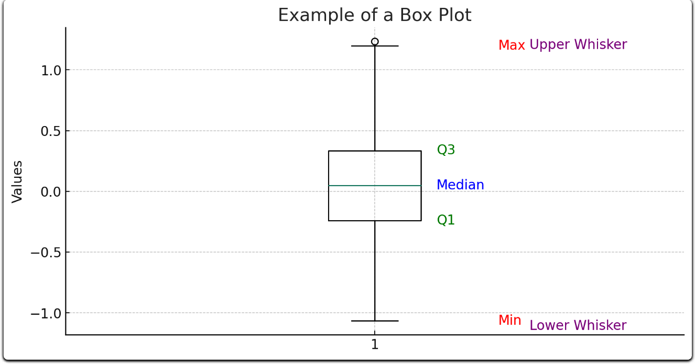

Wykres pudełkowy nam w jakim zakresie znajduje się 50% danych bo od kwartyle 1/4 do kwartyla 3/4. Te patyczki(whiskers) sięgają nam w taki sposób $Q_1/Q_3$ -/+ $1\frac{1}{2} IQR$. To co widzimy to rozkład zbliżony do normalnego, w którym mamy jednego outlinera zaznaczonego kropką, jeżeli mielibyśmy rozkład skośny to wtedy, mielibyśmy przesuniętą miedianę w pudełku, oraz whiskersy byłīby troszkę, krótsze, ale to jest wynikowa przesunięcia tej mediany tak naprawdę

## Regression

### Draw the flow-chart diagram for making predictions using regression as ML algorithm. Explain briefly each box on the flow-chart: ML model, ML algorithm, Quality metric, Feature extraction.
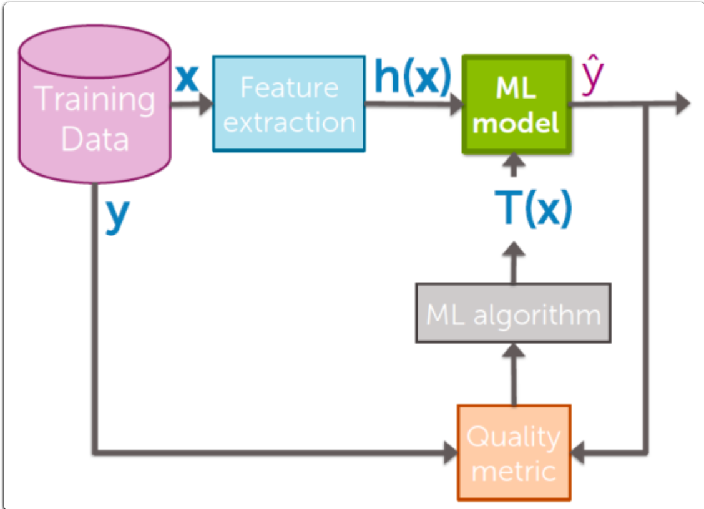
Możemy zobaczyć tutaj 5 typów:
- **Training Data**: Nasz zbiór trenujący
- **Feature Extraction**: Inaczej preprocessing naszych danych, czyli przetworznie ich, encoding danych(onehot na przyklad), wybranie odpowiednich feature z naszych danych, skalowanie ich, często dokonywanie jakieś transformacji TF-IDF, jakaś normalizacja itd.
- **ML-model**: to jest nasz model, który jest wynikiem ML_algorithm, mozna powiedziec ze to juz jest ta gotowa skrzynka do ktorej wkladamy nasze dane i dostajemy output
- **ML-algorithm**: tutaj tak naprawde jest trenowany nasz model, który jest robiony różnymi technikami, czy to liniowa regresja, czy to sieci neuronowe, czy to SVM, czy to drzewa, czy cokolwiek innego
- **Quality Metric**: Na samym końcy patrzy jak dobre nasz model generalizuje nasze zadanie, wynik z metryki przekazywany jest do algorytmy trenującego, a ten następnie dostosowuje model, aby polepszyć wyniki.

### Write down formula for simple linear regression model. How one can interpret coefficients. Write formula for defining cost function using RSS estimator.

Zacznijmy może od uogólniego wzory na regresję liniową prostą:

$Y = \Beta_0 + \Beta_1 X + \epsilon$

gdzie Y to są nasze faktyczne dane, $\Beta_0$ to jest nasz współczynnik wolny $\Beta_1$ to są nasze współczynniki przy zmiennych, a X to macierz naszych danych wejściowych. Epsilon, mozna nazwać takim błędem, który w modelu nie jest brany pod uwagę, ale jest to tak naprawdę zmienna aby dopełnić nierówność, jej raczej nie bierze się pod uwagę.

Mozna te współczynniki interpretować na kilka sposobów
- Bete zerową, można widzieć jako to przesunięcie wykresu w góre lub w dół, jeśli mielibyśmy dane wycentrowane wookół zera to wtedy nasza Beta zero, powinna wynosić 0
- Bete niezerowe, mozna interpretować tak, że mówią nam one o korelacji danych, że jedna dana maleje, kiedy inne rosną itd, oraz jak szybko rosną przeciw bądź wprost proporcjonalnie


Zacznijmy od tego co to jest RSS, jest to Residual Sum of Squares, czyli kwadratowa suma błędów. To jest metryka bardzo istotne:

RSS(model) = $\Sigma_{i=0}^{n} (y_i - \Beta_0 + \Beta_1 X_i )^2$

W prostszych słowach jak bardzo do kwadratu przewidzenie odbiega od próbek wszystkich. Czyli parami idziemy liczymy jakie przewidziane y wychodzi i patrzymy jak bardzo sie rozni od faktycznego i dostosowujemy wagi jakby co, robimy to oczywiscie gradientem descent

### Write down sequence of iterative gradient descent algorithm finding minimum of the cost function for simple linear regression. When do we stop iteration, how do we choose step-size.

Zacznijmy po kolei:
  1. **INICJALIZACJA**: Tak naprawdę trzeba sobię zacząć w jakimś punkcie, wybrać go i od niego będziemy iść. Mamy oczywiście wagi startowe, które możemy w różny sposób zainicjalizować może to być losowa inicjalizacja, z rozkładu normalnego albo jednorodnego, przyciętegeo jednorodnego/normalnego bądź nie itd. Jest wiele sposobów, trzeba testować
  2. **KROK W STRONĘ NAJNIŻSZEGO SPADKU**: Krok robimy tak naprawdę z uwzględnieniem gradientu, w stronę najniższego spadku. Normalnie gradient mówi nam o najszybszym wzroście, ale jeśli postawimy sobię minusik przed gradientem dostaniemy najszybszy spadek. Ponieważ nasza funkcja straty musi być różniczkowalna, liczymy z niej gradient i następnie wyliczamy sobię dla danych wag najszybszy spadek i "podążamy" w jego kierunku czyli aktualizujemy wagi odpowiednio: $w_{new}=w_{old}-\lambda gradientStep$, a $gradientStep = \frac{\delta CostFunc}{\delta w}$. To samio dla bias, tylko wtedy trzeba zmienic pochodną lekko, bo ona będzie bo dla innje wielozmiennej ją robimy.
  3. **POWTARZAMY**: Iterujemy po tym kroku 2, dopóki, nie osiągniemy zbieżności. A czym jest ta zbieżność? Albo możemy ją uznać jako wystarczająco mały krok(czyli zmiana, wtedy wiemy, że wpadliśmy w jakieś minimum, nie ma gwaracji globalnego minimum, ale to swoją drogą).
  4. **WARUNEK STOPU**: w zasadzie są różne:
     * *Wystarczająco mały krok*: tak jak wyżej wspomniane, przy małych zmianach uważamy, że osiągnieliśmy zbieżności
     * *Maksymalna liczba iteracji*: Możemy sobie określic, że po odpowiedniej ilości iteracji zatrzymujemy się
     * *Norma gradientu*: Nie chwytaj, ale chodiz coś z tym, że jesli nroma gradientu wyliczonego jest wystarczajaco mala to wtedy się zatrzymujemy, ale to jest analogia to dałego kroku
     * *Walidacyjny warunek stopu*: W kerasie callback EarlyStopping tak zwany, czyli zatrzymanie przed wczesne, jeżeli np następuje już przetrenowanie modelu lub inny warunek

W zasadzie to jest spadek gradientu taki najprostrszy. Teraz pytanie czym jest learning rate, to jest ta lambda która skaluje krok gradientu, czyli jak duży on będzie, w SGD, ten krok jest skalowany w stały sposób bez zmian w czasie. Ale istnieją odmiany GD, które mają ten krok zmienny(nie koniecznie mówie o lambda). Spójrzmy na kilka z nich:
  - **SGD with momentum**: Tutaj mamy jeszcze stochastyczny spadek gradientu z wektorem 'momentu pędu'. Spójrzmy jak wygląda wzór. Normalnie mieliśmy $w_{t+1} = w_t - \lambda g(w_t)$. Ale tutaj jest pewna modyfikacja, dodajemy ten wektor pędu $w_{t+1} = w_t + v_{t+1}$ gdzie $v_{t+1} = p v_t - \lambda g(w_t)$. W praktyce mówi nam to tyle, że jeżeli mam duży skok, to rozpędzemiy się bardzo i w następnej iteracji również bedziemy rozpędzeni, ale jeśli skok jest mały, to mało akcelerujemy. Następnie jeżeli w którymś momencie przestrzelimy minimum, będziemy musieli gwałtowanie zachamować i ten wektor się skasuje jak wpadniemy w bardziej wyboiste minimum, a będzie fajnie wychodził z takiego płytkiego(czesto minimum pułapka). Bo wtedy będziemy mieli znak ujemny jak przestrzelimy lekko minimum

W kązdym razie samo dostosowanie learning rate mozna zrobic roznymi metodami, grid search, random search, bayesan search itd. metoda łokcia, czy jakieś inne dobory.

### How do we access performance? Explain what is the "training error", "validation error", "generalization error", "test error". What does it mean "cross-validation"? Draw illustrative plot how they typically behave with regression model complexity.


Tak naprawdę celem modelu jest nic innego jak generalizacja problemu. Więc rozpiszmy sobie definicje:
- `Training Error`: jaki jest błąd na zbiorze do uczenia się. Mówi nam jak dobrze model nauczył się danego zbioru uczącego.
- `Validation Error`: zbiór ten dalej jest używany w procesie uczenia się modelu, ale nie do samego uczenia się. to znaczy, że testujemy jak dobrze model generalizuje teraz problem w danej epoce uczenia. 
- `Test Error`: zbiór, który nie był używany podczas uczenia się, najlepiej przybliża hipotetyczną wartość `Generalization Error`, którą zaraz omówię. Jest to zbiór do KOŃCOWEJ ewaulacji modelu.
- `Generalization Error`: hipotetyczna wartość jak nasz model zachowa się dla nigdy nie widzianych danych. Tak naprawdę funkcją zbioru testowego jest przybliżanie właśnie tejże wartości

CV, służy do lepszego sprawdzenia czy nasze hiperparametry modelu są dobrze dobrane. Sprawdza on na większej ilości kombinacji zbioru czy napewno jest to dobry dobór. Służy też do hyperparameter-tuning.


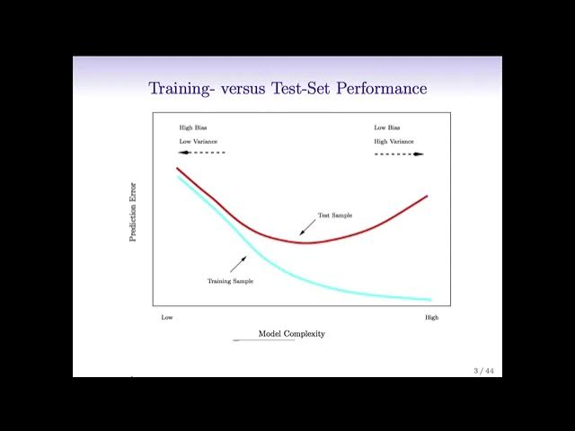

`Generalization Errot` byłby gdzieś w okolicach test error, a walidacyjny błąd pewnie poniżej tego generalizycyjnego albo bardzo zblizony

### Explain what are the sources of errors on the prediction: noise, bias, variance. Draw simple illustration explaining it. What does it mean bias-variance trade-off.


Mamy 3 różne możliwe pochodzenia błędów:
- `noise`: w zasadzie nie usuwalny czynnik, który poprostu jest szumem danych, nie możliwy do zamodelowania.
- `bias`: bardzo mocno związany z pojęciami zbiorów testujących i tranujacych, bo tutaj mówimy o tym jak dobrze modelowi udało się dopasować do danych. Wysoki Bias oznacza, że model do danych dopasowany jest źle, a niski Bias mówi, że model dopasował się do danych świetnie. Wysoki bias oznacza, że model jest zbyt prosty, by uchwycić wzorce w danych (np. użycie regresji liniowej dla nieliniowych danych).
- `variance`: Wariancja mówi nam o tym jak przewidzenia modelu odbiegają odbiegają bardzo od tego jakie faktyczne są dane(np testowe). Wariancja dotyczy tego, jak bardzo przewidywania modelu zmieniają się w odpowiedzi na różne zbiory treningowe. Wysoka wariancja oznacza, że model jest nadmiernie dopasowany do danych treningowych (przechwytuje szum jako wzorce) i może źle generalizować na nowych danych.

Całą ideą uczenia maszynowego, jest zachowanie tego balansu, nie chcemy dopasować za bardzo modelu(overiffiting, low bias, high variance), bo wtedy nie będziemy generalizować dobrze. Ale nie chcemy też nie nauczyć się w ogóle z danych (underfitting czyli high bias, może się okazać, że wariancja niska)

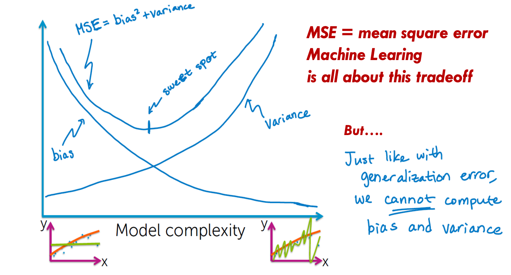


### What does it mean "over-fitting"? Explain how we can mitigate it adding extra term to the cost function: "ridge regression" or "lasso regression". Write formula of the respective cost functions. Show illustrative plot how the coefficients w will behave in each case.


Zaś odpowiedź na wszystkie pytania po kolei. Over-fitting co tez juz zostalo wyjasnione, moze oznaczac jedno jeszcze rzecz, współczynniki są BARDZO wysokie, może nie musi oczywiście, zazwyczaj tak jest, aby temu zapobiec wprowadza się tak zwana regularyzację L1 i L2(odpowiadające im metryki). Odpowiednio modyfikujemy funkcję straty w następujący sposób:
- **Ridge Regression**: RSS(w) + $\lambda ||w||_2^2$
- **Lasso Regression**: RSS(w) + $\lambda ||w||_1$ (tak tutaj nie ma kwadratu, chodzi o pochodną jak coś, klasycznie...)

Tutaj obrazek dla lasso i ridge jak zachowują się wagi:
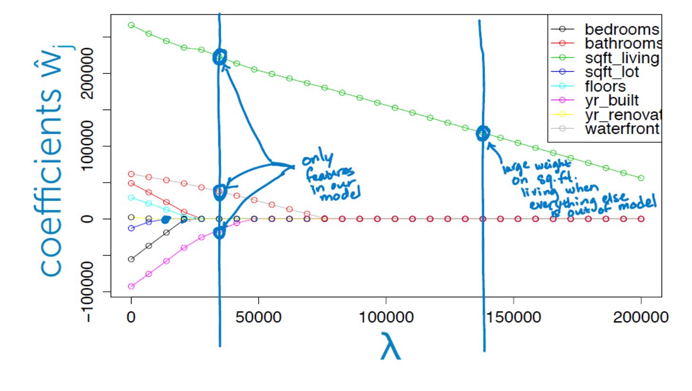
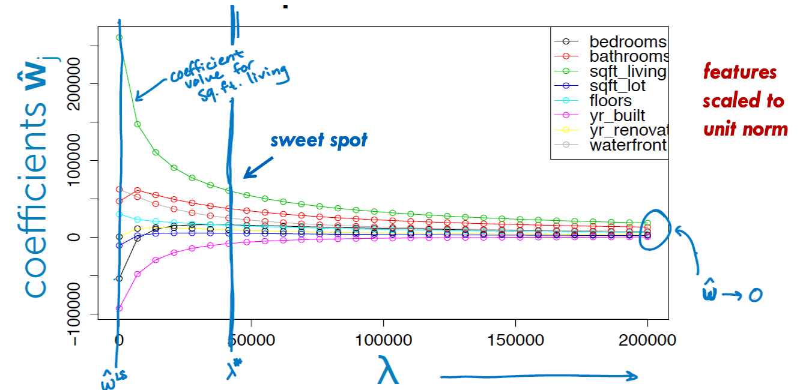


### Explain procedure for selecting features for regression with the greedy algorithm.


Normalnie szukalibiśmy kombinacji która daje najlepsze wyniki, ale to jest praktycznie niemożliwe do wykanania, bo mamy czas wykładniczy szukania tego, za to można użyć algorytmu zachłannego, który na początku bierze jakiś feature, który daje optymalne wyniki, jakikolwiek w zasadzie i nastepnie patrzy, który kolejny feature daje najlepsze wyniki, to prowadzi to zmniejszania błedu w każdej iteracji, podobno w pewnym momencie te obydwa rozwiązania zbiegają do tego samego, ale wiadomo, greedy nie zawsze da najbardziej optymalne rozwiązanie. Istotnie tutaj będzie O(N^2), zamaist wykladniczego O(2^N), bo tutaj nie testujemy kazdej kombinacji feature :D

### What does it mean "non-parametric regression". Explain concept of: (1-NN) regression, (k-NN) regression, weighted regression, kernel regression.


Parametryczna regresja, zakłada, że mamy jakąś matematyczną formę lub strukturę która stoi za danymi, starami się doposować kształt jakieś funkcji do danych. W nie parametrycznej regresji nie ma czegoś takiego, dane jakby mówią za siebie. Patrzymy tutaj nie na zasadzie,że przybliżamy jakąś konkretną funkcję. Nie zakładamy jej kształtu, ani konkretnej formy i to daje nam wiekszą elastyczność.


- **k-NN/1-NN regression**: w zasadzie to samo, ale różni się hiperparametrem czyli ilością sąsiadów jakie porównujemy. Bo kNN, podczas przybliżania. Wyobraźmy sobie punkciki, mamy jakiś punkt który chcemy przewidzieć pośrodku nich, dla 1NN wezmiemy wartosc najblizej lezacego punktu, dla 1NN wezmiemy sobie nie wartosc jednego najblizszego punktu, ale srednia wartosc k punktow najblizszych.
- **weighted regression**: Tutaj w zasadzie mamy do czynienia z tym samym co u górze, ale kładziemy nacisk na domu położone bliżej, ten środek ciężkosci k punktów, co daje nam bardziej punkty zblizone do tych lezacych najblizej
- **kernel regression**: tak jak tutaj u góry mówiliśmy o dość abstrakcyjnym pojeciu ważonej regresji tak tutaj mamy jej konkretną implementację. Bierze ona pod uwagę wszystkie punkty!!! A nie tylko k z nich. W zasadzie jest jedna bardzo istotna funkcja liczenia średniej odległości opartej o jądro ktora nosi nazwe po nazwiskach dwóch panów: Nadaraya-Watson. Wygląda następująco

$y_prediction = \frac{\Sigma_{i=1}^{N} Kernel_\lambda (distance(x_i,x_prediction)) y_i}{\Sigma_{i=1}^{N} Kernel_\lambda (distance(x_i,x_prediction))}$

Widzimy, że jest to pewnego rodzaju średnia ważona generująca środek masy punktów w oparciu o jądro. Przez co lokalnie dostaniemy przybliżenie w zależności od dystansów od punktu.

## Classification

### Explain model of logistic regression classifier. Write down formula for linear score and logistic link function. How it is extended in case of multi-classification problem.

A więc jak regresja liniowa służyła do dopasowania jakieś funkcji do danych aby móc przewidzieć jakies wartości i to nazywaliśmy problemem regresyjnym tak tutaj mamy problem klasyfikacyjny, czyli czy dany osobnik nalezy do klasy A,B,C itd. Tutaj chcemy coś sklasyfikować. Jeżeli dane są liniowo separowalne, wtedy, aby je perfekcyjne wręcz sklasyfikować można wytyczyć prostą przez nie, rozdzielając je na dwie grupki(w zasadzie tutaj mówimy o binarnej klasyfikacji narazie). Tylko teraz jak tę naszą linie wytyczyć tak, aby rozdzielala nam dobrze te dwie klasy, trzeba uzyc zlaczenia dwoch funkcji: 
- **wyniku liniowego** (linear score): $Score(x_i) = W^T h(x_i)$, to jest zwykła funckja liniowa przewalona na stronę prawą/lewą, ten wynik mówi nam jak relatywnie blisko/daleko jest punkt od prostej. Ale to nam nic nie mówi o tym, czy nasze klasy są dobrze podzielone, czy znajdują się na dobrych stronach itd
- **logistic link function** (w zasadzie funkcja, transformacji prawdopodobieństwa): $P(Score(x_i))$, mówi nam o z jakim prawdopodobieństwem jakaś próbka należy do danej klasy bazując na jej odległości od prostej. Przykłądem takiej funkcji może być, sigmoid(dla bin. klas.), softmax(dla multi klas.), signum(najprostsza, ale średnio przydatna przy bardziej złożonych problemach, bo dostajemy wynik należy/nie należy, raczej używamy sigmoid)

Do tego jeszcze trzeba dodać, że aby móc za pomocą regresji rozpoznawać próbki, gdzie ilość klas jest większa od 2 (czyli problem wieloklasowej klasyfikacji), to wtedy mamy kilka podejść
- **1 versus ALL**: dla każdej klasy robimy osobno trenujemy regresje logistyczna, że albo jest tą klasą konkretna albo innymi i patrzymy potem, która jest najbardziej prawdopodobna ze wszystkich, wtedy jest tej klasy
- **1 versus ALL with SOFTMAX**: aby uniknac tego ze te prawdopodobienstwa nie sumuja nam sie do jedynki, to uzywamy softmax, na koncu, przez co dostaejmy prawdopodienstwo sumowane do 1

Funkcja straty dla problemów binarncyh to binarna krzyżowa entropia, a dla wieloklasowych problemów entropia krzyżowa wieloklasowa

### We measure performance of the classifier based on: "classification error",  "classification accuracy", "confusion matrix". Could you explain what does it mean? What is the problem of "class majority".


Wyjaśnienie jest dosyć proste:
- **Classification Error**: Błąd klasyfikacji, czyli ze wszystkich próbek ile procentowo jest źle sklasyfikowanych
- **Classification Accuracy**: Dokładność klasyfikacji, ile próbek sklasyfikowanych poprawnie
- **Confusion Matrix**: Wygląda następująco: 
  ```
             |Class Poss |Class Neg |
  Actual Pos |     TP    |    FN    |
  Actual Neg |     FP    |    TN    |
  ```
  Gdzie warte pamiętania jest, że TP(true positive) znaczy, że próbki sklasyfikowane poprawnie, ktore rzeczywiście są poprawne, FP(false positive), próbki sklasyfikowane poprawnie gdzie w rzeczywistości są one negatywne(innej klasy tej drugiej).


Problem niezbalansowania klas:

**Opis sytuacji:**
  - Mamy zbiór danych, w którym klasy są rozłożone nierównomiernie (np. w stosunku 80%:20%). Oznacza to, że większość próbek należy do jednej klasy (klasy dominującej), podczas gdy druga klasa (klasa mniejszościowa) ma znacznie mniej reprezentantów.

**Konsekwencje dla uczenia maszynowego:**
  - Przewaga klasy dominującej: W klasyfikacji, model ma naturalną tendencję do "faworyzowania" klasy dominującej, ponieważ maksymalizowanie dokładności (accuracy) w tym przypadku oznacza po prostu przewidywanie klasy dominującej w większości przypadków. Przykład:
    - Jeśli model zawsze przewiduje klasę 1, osiągnie dokładność 80%, co wydaje się dobre, ale jest całkowicie bezużyteczne dla klasy mniejszościowej.
  - Trudności w uczeniu się granic decyzyjnych: Ze względu na mniejszą liczbę przykładów klasy mniejszościowej, model ma mniej informacji, aby poprawnie zrozumieć i nauczyć się reprezentacji tej klasy. Może to prowadzić do:
    - Przesunięcia granic decyzyjnych w stronę klasy dominującej, co skutkuje większą liczbą błędów dla klasy mniejszościowej.
    - Braku generalizacji: Model słabo radzi sobie z przykładami klasy mniejszościowej w nowych, niewidzianych danych.

**Statystyczne wyjaśnienie:**
  - Przy losowym wyborze próbki istnieje wysokie prawdopodobieństwo trafienia klasy dominującej (np. 80% w Twoim przykładzie). To oznacza, że model optymalizowany pod kątem minimalizacji błędu będzie "ignorować" klasę mniejszościową, ponieważ jej wpływ na funkcję kosztu jest statystycznie mniejszy.

**Dlaczego to problem?**
  - W praktycznych zastosowaniach klasy mniejszościowe są często kluczowe (np. wykrywanie oszustw, diagnozowanie rzadkich chorób, klasyfikacja defektów). Ignorowanie ich prowadzi do nieprzydatnych modeli, nawet jeśli ich dokładność wydaje się wysoka.


### Write formula for quality metric in case of logistic classifier: likelihood function. The best classifier is found using MLE (maximum likelihood estimation) method and gradient ascent. Could you write down and explain final formula of that algorithm. How do we choose step size.

- **likehood function**: $\mathcal{L}(\theta) = \prod_{i=1}^{N} p(x_i)^{y_i} (1 - p(x_i))^{1 - y_i}$

- **log likehood function**: $\log \mathcal{L}(\theta) = \sum_{i=1}^{N} \left[ y_i \log(p(x_i)) + (1 - y_i) \log(1 - p(x_i)) \right]$. Ze względu na pochodną ładniej użyć tej funkcji

- **derivate of log likehood function**: $\frac{\partial}{\partial \theta} \log \mathcal{L}(\theta) = \sum_{i=1}^{N} \left[ y_i - p(x_i) \right] x_i$

Nie muszę mówić, że maksymalizujemy "pewność" naszego modelu. Krok dostosowujemy tak jak w normalnym gradient descent. W zasadzie to juz tłumaczone, czesto w SGD, metoda łokcia, prób i błedów. Bo za mały learning rate powoduje, że długa zbieżność i możemy wpaść w minimum lokalne, a za duży krok, to że będziemy przestrzelać minima lokalne optymalne i w nic nie wpadniemy 

### Classification with decision trees. How one defines classification of the final leafs. How one measure quality of the predictions: error and accuracy.  Explain simple greedy algorithm to find the best decision tree. How one is measuring performance.
Dobrze narysyjmy sobie drzewo
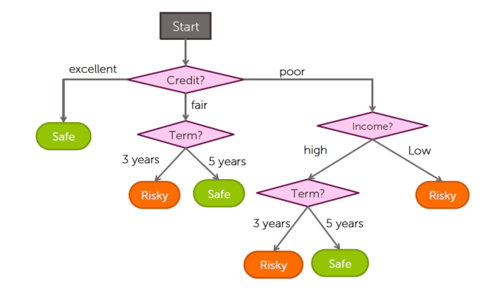

Aby sklasyfikować jakaś próbkę należałoby najpierw przejść przez wszystkie węzły drzewa, dopóki nie dojdziemy do końca, kiedy znajdziemy się w liściu, kończymy naszą wędrówkę i patrzymy jaką klasę klasyfikuje jeden liść.

Jeśli chodzi o metryki, to tak samo jak dla każdej klasyfikacji(tylko istotnie patrzymy na każdy jeden węzeł w drzewie). Ale istnieje też wskaźnik Giniego, który mierzy zanieczyszczenie w każdym węźlie drzewa, na przykład jeśli w danym węźlie będziemy mieli próbki które należą i do klasy jeden jak i do klasy dwa i ich proporcja będzie równa 1:2 to wtedy wskaźnik giniego wkaże 0.5. Wyraża się on wzorem $G_i = 1 - \Sigma_{k=1}^{n} p_{i,k}^2$ gdzie p to jest proporcją danej klasy do wszystkich próbek, które są zaklasyfikowane w tym weźle. Oczywiście nie musze mówić, że to ma sens, jeśli mierzymy np jaką dokładność klasyfikacyjną osiągneło drzewo na całym zbiorze a nie małym ułamku zbioru

Jeśli chodzi o algorytm uczenia się, to zachłanny algorytm CART, generuje drewa binarne(raczej on jest używany). Zobaczmy krok po kroku:
1) Dzielimy dane na feature poszczególne i patrzymy dla jakiego najlepiej dzielimy zbiory(można patrzyć na entropie krzyzowa, wskaznik ginniego)
2) Robimy więc drzewo poszerzone o kolejne dzieci
3) Patrzymy czy dla któregoś z dzieci wskaźnik ginniego nie wynosi 1(mamy tylko jedną klasę), jesli tak przerywamy dla tego dziecka
4) Jesli nie lecimy od poczatku, najlepszy feature i dzielimy według niego drzewa

Jednym z warunków stopy jest i moze być:
- maksymalna głębokośc drzewa
- nic więcej do roboty, mamy tylko jedną klasę
- albo nie mamy już feature do podzielenia(w przypadku kategori to się zdarze, dla jednego z podrzew)

Ale jak już tu jestem to wyjaśnie jeszcze jak dzielić feature numeryczne oraz jak radzić sobię z klasyfikacją wieloklasową.

A więc robimy tak samo jak z binarną, ale mamy więcej klas i tyle, nic się nie zmienia

Jeśli chodzi o zaś o podział numerycznych danych to mamy całą nową teorię, bo fajnie byłoby znaleźć jakieś optimum podziału dla którego porównujemy z resztą :D A więc musimy najpierw posortować nasze punkty i potem po środku każdej pary idąc od prawej strony, patrzymy czy taki podział nie jest lepszy od każdego innego(wskaźnik Ginniego). Nie muszę mówić, że feature numerczyny może być użyty kilka razu, ze względu na różnorakie przedziały :D

### Greedy decision tree learning: what are the steps for building tree. Stopping conditions for the splitting in the decision tree model. What is the sign of over-fitting in decision trees, how one mitigate this effect: early stopping or pruning. Could you explain what does it mean?

Zacznę od overfittingu, bo wcześniejsze opisałem w poperzednij punkcie. A więc znakiem overfittingu jest poporstu za mała wartośc training error i zbyt pewne drzewo, tak jak zawsze. 

Teraz omówmy jak złagodzić efekt nad dopasowania:
- **EarlyStopping**: w tym przypadku kiedy validation_treshold zostanie przekroczony przerywamy uczenie, tak jak w przypadku sieci neuronowych. Ale Mamy różne jeszcze warunku tego early stoppingu
  - **Validation Error**: wystarczająco mały i podział niewiele zmienia, wtedy przerywamy
  - **Depth limit**: Mamy wystarczająco głębokie drzewo
  - **Minimal Node size**: W weźlie jest za mało osobników, więc też przerywamy
- **Pruining**: uproszczamy drzewa po wykonaniu algorytmu, analogicznie jak w earlystopping opisanym na gorze, ale na odwrót

### What are strategies for handling missing data in case of decision trees.
1) Usuwanie
   - Usuwamy wiersze z NULL, pomijamy je w uczeniu się :D
   - Usuwamy feature z brakującymi danymi
2) Wstawianie
   - Wstawienie najbardziej popularnej wartośći dla kategori, a dla numerycznych wstawienie średniej albo mediany
3) Adaptacja algorytmu
  - uwzględniamy w decyzji wartości NULL, że np coś jest bezpieczne albo unknown(NULL) itd

### Idea of ensemble classifiers and boosting. Could you explain the concept of weighted weak classifiers and weighted data. Could you write down formula for final model predictions.

Zacznijmy może od ogólnego pojęcia **uczenia zespołowego**. Co ciekawe okazuję się, że połączenie wielu `weak-learnerów` w jeden duży klasyfikator daje nam tak zwanego `stron-learnera`. Istotnie tutaj prawo wielkich liczb daje o sobie poznać. Ale istotne jest to, że zamiast bazować na głosie jednego klasyfikatora, robimy ich kilka i każdy z nich głosuje, jak klasyfikujemy próbkę. Następnie ich przewidzenia sumujemy i patrzymy sobie jaki jest wynik grupy. Są różne metody sprawdzania jaki jest finalny głos grupy:
- "miękkie": czyli takie, że modele generujace prawdopodobienstwo, ze dana klasa bedzie. My sobie uśredniamy te prawdopodobienstwa(mozna wprawadzic wagi), dla każdej klasy i patrzymy, która jest bardziej prawdopodobna(wtedy np glosy o wiekszej pewnosci maja wiekszą wagę itd)
- "twarde": patrzymy sobie, która klasyfikacja pojaiwa się najczęściej, czyli np model 1 przewidzial klase A, 2 klase A, 3 klase B, oczywiscie moze to byc z pewnymi prawdopodobienstwami, ale liczy sie finalna klasa i na tej podstawie patrzymy, która klasa jest w większości głosowania i sobie ją wybieramy jako wynik. Tutaj tez mozemy dodac wagi do koncowego wyniku

**Boosting** zaś to metoda, której zadaniem jest skupianie uczenia na trudnych punktach zbioru danych. 

Jeśli chodzi o koncept ważenia danych, to jedną z metod wykonywania tego jest boosting. W przypadku trudnych punktów w zbiorze, wagi tych punktów będą większe od prostszych punktów w tym zbiorze, czyli takich, które klasyfikowane są dobrze. Z klasyfikatorami jest podobnie, jeśli jakiś klasyfikator zwraca dobre wyniki, jego waga będzie pozytywnie wysoka, jeśli jest czegoś bardzo niepewny jego waga będzie bliska 0, a jeśli będzie bardzo pewny niepoprawnych wyników jego waga będzie schodzić ponieżej 0. 

Tutaj formułka na wzór wyniku głosowania z wagami
$\hat{y} = sign (\Sigma^T_{t=1} \hat{w_{t}} f_t (x))$

### AdaBoost algorithm, formulas, learning process.
1) Zainicjalizuj wszystkie wagi punktow tak samo czyli $\frac{1}{N}$
2) Dla każdego klasyfikatora
   1) Naucz go na ważonych danych i sprawdź jego błąd
   2) Wyznacz jego współczynnik zaufania
   3) Popraw wagi punktów i je znormalizuj
3) Sprawdź zachowanie całego klasyfikatora $\hat{y}(x) = argmax_k \Sigma_{j=1, \hat{y}(x) = k}^N \alpha_j$

Teraz trochę o wzorach
- Initialize Sample Weights: $w_i^{(1)} = \frac{1}{N}, \quad i = 1, 2, \dots, N$

- Weighted Classification Error for predictor j: $r_j = \frac{\Sigma_{i=1, \hat{y_j^{(i)}} \neq y_j^{(i)}}^N w^(i)}{\Sigma_{i=1}^N w^(i)}$

- Classifier Weight: $\alpha_j = \lambda \ln\left(\frac{1 - r_j}{r_j}\right)$

- Update Sample Weights(KAŻDY PREDYTKOR AKTUALIZUJE WAGI): $w_i^{(t+1)} = w_i^{(t)} \exp(\alpha_j)$

- Normalize Sample Weights: $w_i^{(t+1)} = \frac{w_i^{(t+1)}}{\sum_{i=1}^{N} w_i^{(t+1)}}$

- Final Strong Classifier: $\hat{y}(x) = argmax_k \Sigma_{j=1, \hat{y}(x) = k}^N \alpha_j$

W ten sposób klasyfikatory poprawiają się nazwajem. Kładąc nacisk mneijszy bądź większy. Istotnie AdaBoost jest alogrytmem głosujący większościowo("hard"), a więc patrząc sobie na konkretne wagi sumujemy dla danego przewidzenia danej klasy

## Clustering&Retrieval

### Explain TF-IDF representation of documents. What are the metrics which are most commonly used to search for k-NN documents.

A więc jak TF znaczy **term frequency**, czyli sama częstość występowania słów w danych dokumencie, tak IDF oznacza **inverted doc frequency**, czyli jest to przekształcenie pokazujące jak rzadkie jest dane słowo globalnie, co oznacza, że jeżeli mamy jakieś słowo, które występuje często tylko w określonej grupie dokumentów, to ono będzie miało przypisaną wyższą wagę

$IDF = log(\frac{num-docs}{1+num-docs-using-word})$

$TFIDF = TF * IDF$

Istotnie najbardziej powszechne metryki w przypadku k-NN to metryki oczywiście odległości wektorów, zobaczmy kilka z nich:
- metryka euklidesowa: $d_{\text{Euclidean}}(x, y) = \sqrt{\sum_{i=1}^{n} (x_i - y_i)^2}$
- metryka cosinus: $\text{cosine\_distance}(x, y) = 1 - \frac{\sum_{i=1}^{n} x_i y_i}{\sqrt{\sum_{i=1}^{n} x_i^2} \cdot \sqrt{\sum_{i=1}^{n} y_i^2}}$
- metryka Manhattan $d_{\text{Manhattan}}(x, y) = \sum_{i=1}^{n} |x_i - y_i|$
- Jaccard
- Hamming
- correlation-based
- rank-based
- Mahalanobis

### What are the KD-trees. How to build and query KD-tree. What is the complexity of querying and how it compares with complexity of other queries: 1-NN, k-NN.
Zacznijmy od budowy drzewa. Budujemy go rekurencyjnie idąć od każdego podzielonego wcześniej pudła. Trzeba jakoś heurystyczne dobrać wartość, wymiar i warunek stopu jak dzielimy. Zazwyczaj zatrzymujemy się jak mamy wystarczająco małe pudła albo za mało punktów w danym pudle. Jeśli chodzi o wymiar po jakim dzielimy to zazwyczaj po tym wymiarze, ktory jest najszerszy. A wartość od ktorej dzielimy, czyli w ktorym miejscu ta kreska ma wgl wyladowac to juz wybieramy albo medianą, albo środek pudła(ignorujemy wtedy wszystkie dane w pudle).

No dobra, ale mamy podział na pudełka i co teraz? Jak wyszukać najbliższy punkt? Zacznijmy od tego, że idąc po wcześniej zbudowanym ala drzewie decyzyjnym(bo tutaj dzielimy po roznych parametrach i mozna potem sprawdzic w jakim pudle jestesmy). Bierzemy punkt położony najbliżej nas w naszym pudle. Następnie jak juz znaleźliśmy, to przyjmujemy odległośc od tego punktu, jako nasz promień. I patrzymy sobie teraz po promieniu, które pudełka leżą w jego zasięgu, jeśli któreś leży to przeszukujemy je w poszukiwaniu najbliższego sąsiada, jeśli tam go znajdziemy, to aktualizujemy promień i zaś sprawdzamy pudełka. W ten sposób nie przeszukujemy całej przestrzeni.

Złożonośc obliczeniowa dla N przeszukań przestrzeni o N punktach:
- kd-Trees: 
  - AVG: O(Nlog(N)) 
  - WORSE: O($N^2$)
- 1-NN/k-NN: 
  - AVG/WORSE: O($N^2$)

### Explain LSH method (locality sensitive hashing). Is it competitive to KD-tree method?
Jest to pewna konkurecja dla kd-trees, ALE tutaj mamy bardzo szybkie przeszukanie kosztem jakości, czasami może się zdarzyć, że będziemy wolniejsi od kd-trees, a rozwiązania dobrego nie znajdziemy. Więc zależy co chcemy, jak zawsze liczy się czas czy dokładność? 

LSH działa w ten sposób, że tyczy losowe linie, które dzielą nam zbiór punktów na koszyki, każdy koszyk ma odpowiedni hash i punktom w tym koszyku przypisuje się tego hasha, następnie mając nowy punkt szukamy w tym właśnie koszyku, najbliższego sąsiada, możemy też przeszukać sąsiadujące koszyki bo tam może się on też kryć. W zasadzie powiększamy przestrzeń przeszukań albo dopóki mamy zasoby sprzętowe albo wystarczająco jakoś NN.

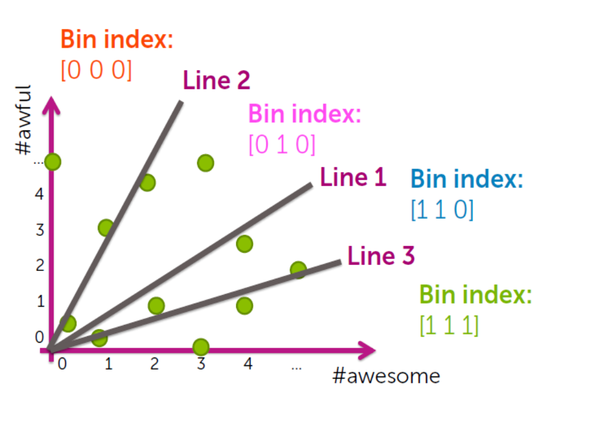

### Describe steps of k-means clustering algorithm. How we measure its quality? Could you comment on its convergence

Od razu zaznacze, że algorytm k-średnich zbiega ku **LOKALNEMU MINIMUM**. Moze być, że będzie wpadało inaczej, ponieważ działa on troche na zasadzie cordinate descent, to wiemy, że będziemy wpadać w lokalne minimum.

Jak on działa? 
1) Inicjalizacja centroidów
2) Wszystkie punkty przypisz do ich klastrów
3) Przesuń centroidy do środka masy klastrów
4) Powtarzaj 2 i 3 do zbieżności

Kilka wzorków jeszcze
- Przypisanie do klastra punktów: $z_i = argmin_j ||\mu_j - x_i||^2_2$
- Przesunięcie centroidów do środka masy: $\mu_j = argmin_{\mu} \Sigma_{i:z_i = j} x_i$

Jakie są metryki, żeby zbadać jakoś klastrów?
- inercja: czyli inaczej suma wszystkich odległośći punktów od jego centroidów im bliżej są tym lepiej
- ilośc członków w klastrach: jeżeli mamy dużo klastrów po jedna dwie jednostki, to możliwe, że przetrenowaliśmy
- Silhoutte score: ocena, mówiąca nam jak bardzo punkty w klastrach są podobne do siebie w tym samym klastrze w porównaniu do innych klastrów. Wartośc od -1 do 1, gdzie 1 to idealne klastrowanie a -1, nic nie wyszło

### Explain probabilistic approach for clustering. The soft assignment can be optimised with MLE approach (maximum likelihood estimator). Can you explain what does it mean, give some formulas?
Istotnie, kiedy robimy, klsutrowanie metodą  k-średnich, to albo jesteśmy w klustrze albo nas nie ma, nawet jeśli znajdujemy się na granicy, gdzieś pomiędzy dwoma klustrami to i tak jesteśmy zaliczani do jednego z tym samy prawdopodobieństwem. Tutaj jest inaczej. Propabilistyczne podejście do tego typu problemów sprawia, że w przypadku na przykład nachodzących klustrów, dostajemy prawdopodobieństwo przynależności do określonego z nich.

Istotnie mamy kilka parametrów w np podejściu GausianMixture, które kontrolują przesuwanie się rozkładów:
- $\mu$ (mean): odpowiada za przesunięcie środka rozkładu
- $\Sigma$ (coviariance matrix): odpowiada za nachylenie i eliptyczność rozkładu (co ciekawe można ograniczyć się tylko do diagonali na tej macierzy, która kontroluje eliptyczność, wtedy dostaniemy prostopadły rozkład do osi układu)
- $\phi$ (mixture coefficient): danym rozkładą nadaję sie wagi

Jeżeli jakis kluster bierze za punkt odpowiedzialność to oznacza to, że należy on do tego klastra.

Tutaj wzorki:
- **Likelihood Function**: $\mathcal{L}(\Theta) = \prod_{i=1}^{N} \sum_{k=1}^{K} \pi_k \cdot p(x_i | \theta_k)$
- **Posterior Probabilities (E-Step)**: $\gamma_{ik} = \frac{\pi_k \cdot p(x_i | \theta_k)}{\sum_{j=1}^{K} \pi_j \cdot p(x_i | \theta_j)}$

- **Update Mixing Coefficients (M-Step)**: $\pi_k = \frac{\sum_{i=1}^{N} \gamma_{ik}}{N}$
- **Update Cluster Means (M-Step)**: $\mu_k = \frac{\sum_{i=1}^{N} \gamma_{ik} \cdot x_i}{\sum_{i=1}^{N} \gamma_{ik}}$
- **Update Covariance Matrices (M-Step)**: $\Sigma_k = \frac{\sum_{i=1}^{N} \gamma_{ik} \cdot (x_i - \mu_k)(x_i - \mu_k)^\top}{\sum_{i=1}^{N} \gamma_{ik}}$

W zasadzie nie wiem co tutaj napisać. Działa tak samo jak kmeans ale inczaej zmienia parametry. Ale co znaczy ze optymalizuje za pomoca MLE, tak jak w przypadku regresji logistycznej mielismy maksymalizowanie tego, aby dany ounkt dalo się jak najpewniej sklasyfikowac, tak tu jest podobnie, chcemy odpowiedzialnośc za punkt była brana z większą pewnościa przez jeden klaster.

### Explain what is the model for "bag-of-words" for clustering documents.
To jest chyba kolejna abstrakcyjna metoda, która bazuje na tym, że zamiast robić wektory, my zbieramy wszystkie słówka z artykułu i grupujemy te słowa według tego do jakiego tematu należą, że artykuł staję się pewnego rodzaju probabilostyczną mieszanką, czy dany dokument należy do jednego tematy czy też drugiego. Dostaniemy więc odpowiednie podziały procentowe, jak bardzo dokumenty określone mówią o odpowiednich tematach

Istotnie my tutaj będziemy tworzyć tabelkę, gdzie dla każdego tematu dostaenimy prawdopodobieśtwo, że określone słowo należy do tematu, to pozwoli nam później określic prawdopodobieństwo

### LDA method (Latent Dirichlet allocation). Can you explain the concept?
Jest to generatywny probabilistyczny model do znajdywania tematów, które zawierają się w danym dokumiencie bazując na kolekcji dokumentów.

Fundamentalnym konceptem jest coś podobnego jak w PBoW(to na górze), czyli każdy dokument składa się zazwyczaj z kilku tematów, a tematy zaś składają się na słowa. LDA stara się znaleźć takie zestawy słów, które najlepiej dany temat opisują.

Koncpet dzialania:
1) Dokumenty z podobnym tematem używają podobnej grupy słów: jeżeli jakieś dokumety dotyczą tego samego tematu, to powinny one zawierać podobne słowa
2) Ukryte tematy: tematy nie są obserwowane bezpośrednio jak to robimy np w TFIDF(gdzie wektor należy do konkretnego klastra), ale tutaj wyciągamy je ze słów jakie posiadają dokumety
3) Dystrybucja dirichleta: dystrybucja tematów oraz słów w tematach ma być podobna do dystrybucji dirichleta.

Teraz spójrzmy na działanie 
1) Dla każdego tematu k:
   1) wybierz dystrybucję słów w temacie($\phi_{k}$) z dystrybucji dirichleta(Dirichlet($\beta$)): każdy temat reprezentowany jest przez wielomianową dystrybucję słów wszystkich
2) Dla każdego dokumetu d:
   1) Wybierz odpowiednią dystrybucję tematów($\Theta_d$) z dystrybucji dirichleta(Dirichlet($\alpha$)): każdy dokument ma unikalny rozkład tematów
3) Dla każdego słowa $w_n$ w dokumencie d:
   1) wybierz temat $z_{d,n}$ z rozkładu wielomianowego(Multinomial($\Theta_d$)): każde słowo wiązane jest z tematem
   2) wybierz słowo $w_{d,n}$ z rozkładu wielomianowego (Multinomial($\phi_{z_{d,n}}$)): słowo jest wybierane na podstawie dystrybucji słów w temacie

### Hierarchical clustering. Explain algorithm, illustrate with dendrogram. 
W zasadzie mamy kilka podejść, bo może się okazać, że nasze klustry wymagają połączenia ze sobą, bo np nachodza na siebie, łatwo sobie taką sytuacje wyobrazić. Wiec fajnym pomysłem jest wzięcie i łączenia tyh klastrów, albo dzielenia ich z większego na mniejsze:
- Divise(top-down): czyli z góry do dołu, zazwyczaj rekursywnie robimy k-srednij, czyli robimy duzy jeden kluster, potem wenwatrz niego pusxczamy kolejne 3 centroidy i dzielimy na 3 klsutry i potem te 3 klsutryrobimy to samo itd.
- Aglomerative(down-top): czyli z dólu do góry, łączymy mniejsze w większe, idąc zazwyczaj, że każdy punkt ma swój własny kluster i łączać jeżeli są wystarczająco blisko siebie za pomocą tzw linkage function

I tutaj parametry do ustalenia dla dzielącego algorytmu:
- liczba klustrów
- rozmiar klustrów
- promień klustra: czyli odległość od centroida do najdalszego punktu spadnie poniżej określonego punktu

W przypadku dzielenia cisniemy rekurencyjnie a w przypadku łączenia, trzeba jakoś zdefiniować jak je łączymy, robimy to funkcją linkage, która jest różnie zdefiniowana. Zazwyczaj ustalamy jakiś treshhold, który mówi, czy merguejmy dalej nasze klustry czy też nie 

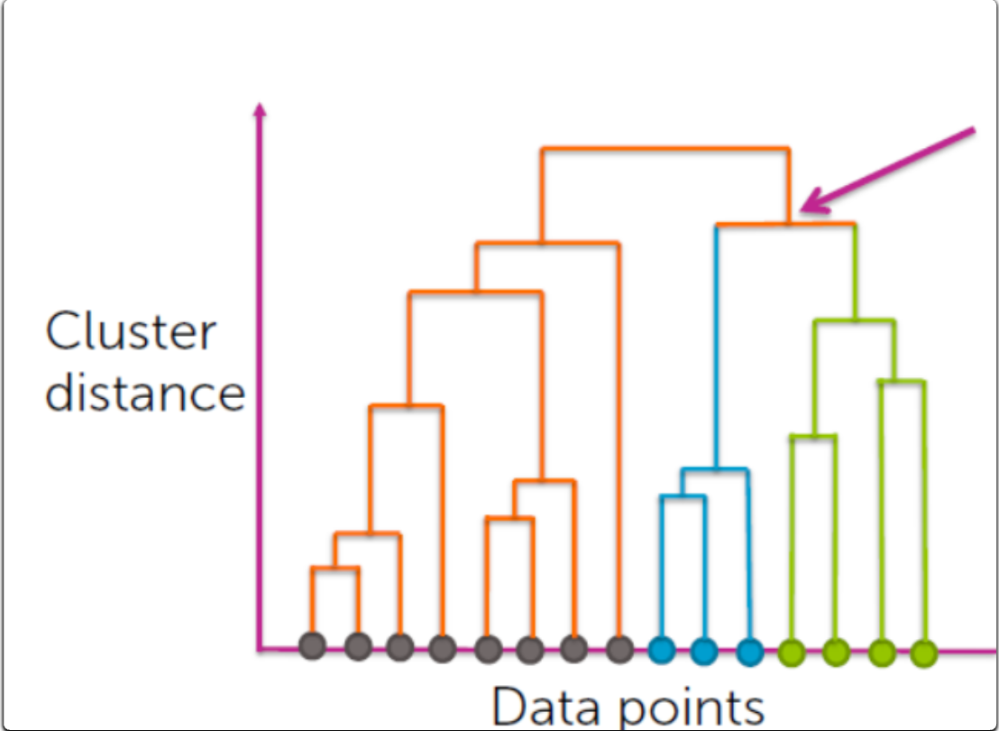

## Recomender system

### Explain what does it mean "Principal Component Analysis".
PCA, służy do redukcji wymiarowości. Załóżmy, że mamy przykładowe dane:


PCA na początku stara się wytyczyć prostą, która dopasuję się do jak największej wariancji danych, innymi słowami mozna też powiedzieć, że zminimalizuje błąd średnio kwadratowy między wszystkimi punktami. Co istotne, dostajemy wtedy naszą pierwszą oś następnie do tej znalezionej osi szukamy ortogonalnej kolejnej i potem ortogonalną do tych już znalezionych, zachowując największą wariancję(to lepiej widać na 3d, jesli chodzi o wybór ortogonalnych osi, w która stronę one będą skierowane). Tylko pytanie jak te osie z najniższą wariancją znaleźć? Oto kilka możliwości
1) Można starać się wyliczyć każdą wariancję z osobna, ale to kosztowne, wtedy bierzemy sobie te wymiary z największą wariancją i po sprawie
2) Zrobić SVD, które od razu wylicza nam wekotry własne macierzy danych, więc dostajemy osie, wobec których idą największe wariancję danych

Jak juz znajdziemy nasze wektory własne/składowe głowne to możemy zająć się rzutowaniem danych na niższe przestrzenie(w zasadzie skrócenie wektora o wymiary xd) i  obliczenie sobie wariancji wyjaśnionej, czyli jak dobrze udało nam się zachować wariancję 

### What are the challenges for building recommender system?
- typ feedbacku: 
  - explicit: użytkownik mówi co lubi, a czego nie
  - implicit: wnioskujemy z zachowań użytkownika, co lubi a czego nie
- Cel: 
  - czasami wystarczy ogólnie zaadresować polecenie np: ludziwe lubiący Rociego 1 lubią też 2,3,4,5 itd
  - ale czasami chcą bardziej personalne polecenie: moze jakis uzytkownik lubi Rockiego 2, ale też jakie inne filmy jak Gandhi itd
- Zimny start: nie mamy danych o użytkowniku, nie wiemy co polecić
- Rozwój w czasie: niektóre rozwiązania się przedawniają, nie możemy polecać całī czas czegoś starego obo było kiedyś modne, system musi umieć adaptować do zmian mikro jak i makro
- skalowalność: czesto mamy duzo danych i duzo uzytkownikow, wiec trzeba uwazac bo niekotre rozwiazania sa O($N^2 + M^2$), fajnie jak trzeba polecić jednemu, ale nie milionowi, trzeba coś co działa optymlanie dla wielu

### Recomender system can be based on: popularity, classification, co-occurence. Can you explain what does it mean.

1. **System rekomendacyjny oparty na popularności**
Rekomendacje są tworzone na podstawie globalnej popularności przedmiotów (np. produktów, filmów). 
Rekomendowany jest towar, który cieszy się największym zainteresowaniem wśród wszystkich użytkowników, niezależnie od ich indywidualnych preferencji.

**Zalety:**
- Łatwa implementacja.
- Brak wymogu danych o użytkownikach (np. historii interakcji).
- Dobrze działa przy dużej liczbie nowych użytkowników.

**Wady:**
- Brak personalizacji.
- Promowanie tylko popularnych przedmiotów (długi ogon zostaje pominięty).

**Przykład:**
- Rekomendowanie najlepiej sprzedających się książek w danym miesiącu.

---

2. **System rekomendacyjny oparty na klasyfikacji**
Ten typ systemu traktuje rekomendację jako problem klasyfikacyjny, gdzie celem jest przewidzenie, czy użytkownik będzie zainteresowany danym przedmiotem (np. kupi produkt, obejrzy film).

**Metody:**
- Wykorzystuje algorytmy klasyfikacji, takie jak:
  - Drzewa decyzyjne.
  - Las losowy.
  - Sieci neuronowe.
  - Regresja logistyczna.

**Zalety:**
- Może uwzględniać różnorodne dane (np. demografię użytkownika, cechy przedmiotu).
- Dobrze działa na małych zbiorach danych.

**Wady:**
- Wymaga etykietowanych danych (np. "użytkownik kliknął/nie kliknął").
- Może być trudny do skalowania przy dużych zbiorach danych.

**Przykład:**
- Klasyfikator przewiduje, czy użytkownik polubi dany film, na podstawie jego gatunku i historii ocen.

---

3. **System rekomendacyjny oparty na współwystępowaniu (co-occurrence)**
Rekomendacje są generowane na podstawie współwystępowania przedmiotów w interakcjach użytkowników. Przedmioty, które są często używane, kupowane lub oceniane razem, są rekomendowane użytkownikom.

**Zalety:**
- Naturalna obsługa danych sekwencyjnych (np. kupione produkty, odtworzone utwory).
- Może działać bez szczegółowych danych użytkownika.

**Wady:**
- Nie uwzględnia cech przedmiotu ani użytkownika.
- Może być mniej skuteczny w przypadku rzadkich współwystąpień.

**Przykład:**
- "Osoby, które kupiły produkt X, kupiły również produkt Y" (np. Amazon).

---

**Podsumowanie**

| Typ systemu               | Zalety                             | Wady                                | Przykład                         |
|---------------------------|-------------------------------------|-------------------------------------|----------------------------------|
| Popularność               | Łatwość implementacji, uniwersalność | Brak personalizacji                 | Najpopularniejsze filmy miesiąca |
| Klasyfikacja             | Uwzględnia różne cechy danych       | Wymaga etykietowanych danych        | Przewidywanie polubień filmu     |
| Współwystępowanie         | Proste powiązania między przedmiotami | Pomija dane użytkownika lub przedmiotu | Kupowane razem produkty          |


### Can you explain what does it mean "matrix factorisation" and "collaborative filtering"? How it can be used in recomended system.
Mówilismy, ze mamy dwa co najmniej typy polecania user-based, item-based, w zasadzie obydwa dzialalo dobrze, item-based przykladem niech bedzie sprawdzanie podobinestwa miedzy dwoma przedmiotami i na bazie tego polecanie, a user-based niech bedzie macierz wspolwystapien(co-occurance), ktora tworzy nam macierz dla kazdego itemu jak bardzo polecimy jakis inny itemek, np grajac w cs go jak bardzo polecimy na przyklad jakas inna gre, jakie wagi powinnismy im przyporzadkowac. Collaborative filtering laczy te dwie cechy.

Faktoryzacja macierzy jeden z takich wlasnie collaborative filtering algorytmow, bardzo fajny system przewidzenia czy jakiemus uzytkownikowi spodoba sie dany film czy nie, na podstawie, feature o danej rzeczy/filmie, a potem na podstawie tego czy uzytkownik lubi dana feature czy tez nie jest ten system w stanie przewidzie czy danemu uzytkownikowi spodoba sie dany film czy tez nie, nawet jesli nie ma nigdzie o tym informacji :D
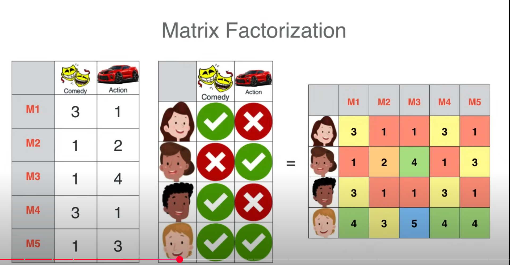

Tutaj jest ciekawa sprawa, ze troche tutaj jest wprowadzona arytmetyka co sprawia, ze mozemy np dodac dwa wiersze z tymi czarnymi i dostaniemy tego czwartego bialego.

Uczenie sie tego jest takie, ze losowo bierzemy nasze macierze wynikowe faktoryzacji i sprawdzamy sobie jaki jest wynik ich mnozenia, jezeli wynik jest daleki to zwiekszamy/zmniejszamy odpowiednio wartosci w macierzach faktoryzacji(gradient descent w zasadzie). Funkcja której będziemy używać to suma kwadratów odległości od ideału a naszych przewidzień. Czyli SE(squared error). I wiadomo tutaj stara gadka, po gradiencie i do przodu, albo jakims cordinate descent.


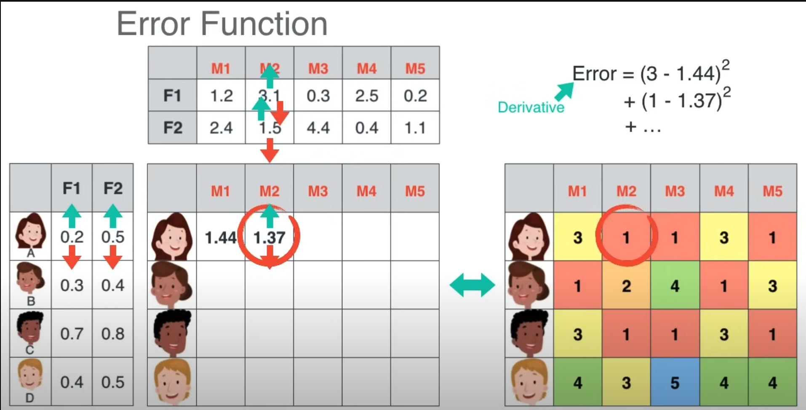

### How we can measure effectiveness of the recomender system.
- **Offline metrics**(takie, które są kalkulowane na podstawie danych historycznych z uzyciem zbiorów testowych, gdzie sprawdzamy czy dobrze polecamy hipotetycznemu użytkownikowi rzeczy)
  - accuracy: $\frac{ilość\_poleconych\_poprawnie}{ilość\_poleconych}$
  - recall: $\frac{liczba\_poleconych\_filmow}{liczba\_wszystkich\_możliwych\_filmów\_do\_polecenia}$
  - f1 score 
- **Online metrics**(takie, które są kalkulowane na bieżąco badając cały czas jakość systemu)
  - współczynnik przeklikania: jeżeli polecimy np 100 filmow i tylko w 10 klikniemy to wspolczynnik przeklikania wyniesie 10% (10/100)
  - współczynnik 'nawrócenia': jeżeli polecamy 10 rzeczy to patrzymy ile z tych rzeczy wywołało jakąś akcję porządaną przez nas pokroju pobranie danej rzeczy albo wyswietlenie filmu itd
  - dlugosc sesji: patrzymy jak dlugo uzytkownik pozostal na platformie po poleceniu mu czegos
  - wspolczynnik wyjsc: patrzymy ile uzytkownikow wyszlo po dostaniu polecenia od nas
- metryki nowości i różnorodności(mierzymy i jedno i drugie w poleceniach)
- metryki feedbacku użytkowników

## Statistical inference

### Statistical analysis: what are principle of experimental desig for data collection.
1) Powtarzanie:
   - Trzeba powtorzyc wiele razy eksperyment, aby miec pewnosc, ze wystarczajaco dobrze generalizujemy całość jako probke
2) Losowość
   - losowe przydzielanie do określonych grup ludzi
3) Separacja(and. Blocking):
   - to jest troszeczke cos innego, anizeli mamy w przypadku losowosci i nie stoi to naprzeciw z nia, tutaj skupiamy sie, aby ludzie o podobnych cechach, byli w tej samej grupie badan(ludzie chorzy na serce i nie) inaczej bedziemy wprowadzac bias. Ale ta losowosc tutaj wchodzi na etapie juz zrobionych tych grup wedlug jakies okreslonej cechy(nie musze mowic, ze tacy ludzie, z np chorym sercem beda zaburzaly statystyke ogolnie ludzi zdrowych)
4) Kontrola
   - kontrola nad feature ktore badamy, jesli testujemy jakis feature, to reszte feature trzymajmy stałe(poziom najedzenia, swiatla, powietrza w pomieszczeniu rozne czynniki ogolnie), oczywiscie feature testowany poddajemy zmianom
5) Ukrywanie informacji(Blinding):
   - ukrywamy informacje o badaniach i jak ludzie sa badani przed badanymi
6) Losowe przydzielanie do grup placebo
   - to jest bardziej medyczna rzecz, ale czasami jest konieczne, sprawdzenie jakby sie ktos zachowal gdyby, nic nie robic, czy mamy jakis wplyw tym co robimy
7) Testowanie cech
   - testujemy jak te cechy niezalezne maja wplyw na to jakie sa wyniki badan naszych badan, moze to byc roznorakie dobieranie tych cech
8) Balans:
   - zachowac trzeba jakis balans miedzy grupami, ktore badamy np taka sama liczba osob, albo klasy zeby hierarchicznie byly, zeby bylo tyle samo osob starszych w kazdej grupie procentowo, itd


### Could you explain what is a Simpson paradox. 
Paradoks Simpsona polega na tym, że kiedy weźmiemy sobie jakieś dwie zmienne które mają jakiś konkretny trend, to okazuję się, że jeżeli wprowadzimy trzecią zmienna to te trendy nagle się odwrócą. To bardzo fajnie widać na tym przykładzie z kotami i ludzmi, ktorych leczymy. Widzimy na tym obrazku ponizej, ze niby mamy dwa rosnace trendy jesli podamy leki, bo zwiekszaja szansę przerzycia, ale jak sobie zobaczymy na prawdopodobienstwa, to tak srednio sie okazuje ze sie polepsza. Paradoks ten polega wiec rowniez na tym jak my patrzymy na dane i fakt, ze z tych samych danych mozemy wyciagnac 2 rozne wnioski na temat tego samego zbioru
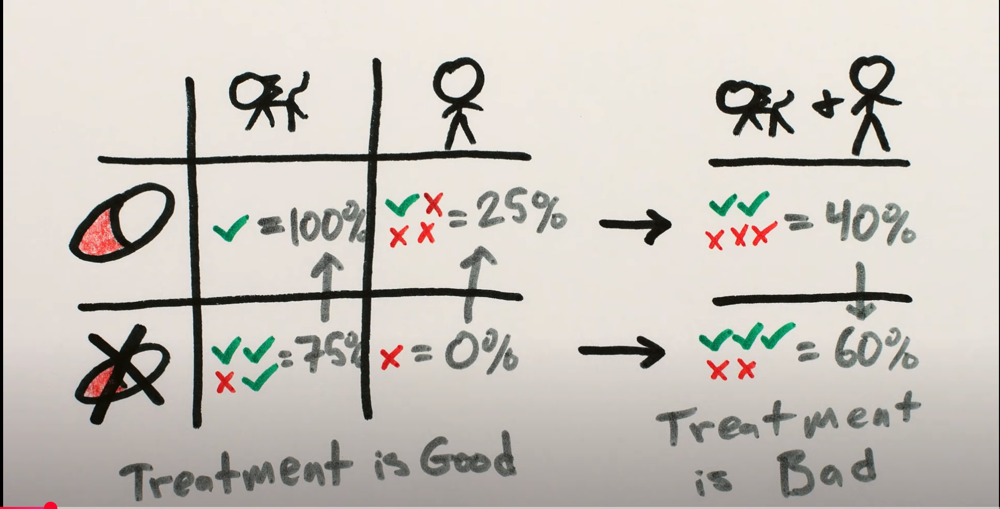

Ale poza tym definicja, ta pierwsza bardziej formalna na egzamin

### Coefficient of determination R^2 is often used to access variability of prediction explained by the model and to quantify quality of the model. Could you explain the meaning of it.
Metryka uzywana do badania jak dobrze nasz model regresyjny wpasowal sie do zadanych mu danych. Normalnie gdybysmy chceli uzyc korelacji, to nie dostaniemy wysokich wyników no chyba, że dane liniowo są od siebie zależne.
Wzór na $R^2$ wygląda następująco:

$R^2 = 1 - \frac{SS_{res}}{SS_{tot}}$ 

Gdzie 
- $SS_{res}$ (residual sum of squares): czyli suma wszystkich odległości do kwadratu, czyli przewidzenie odjąć faktyczne dane do kwadratu
- $SS_{tot}$ (total sum of squares): czyli total sum of squares, czyli mierzymy średnia wszystkich prawdziwych y i potem nasze przewidzenia odjąć od tej średniej do kwadratu i mamy i sumujemy po wszystkich punktach

Istotnie R^2 mierzy proporcje wariancji danej zmiennej y, ktora jest opisana za pomoca niezaleznej zmiennej X w modelu(czyli nasze x i przewidzenia na podstawie tego). Większy R^2 oznacza, ze mamy lepiej dopasowany model. Zakres R^2 jest od 0 do 1 gdzie 1 do idelnie dopasowany, a 0 mówi, że model nie uchwycił żadnej wariancji y i że nie jest lepszy od wzięcia średniej. Czasami moze zdarzyc sie, ze R^2 wyjdzie mniejsze od zera, to oznacza, że nasz model absolutnie źle działa i nie jest lepszy od kreski horyzontalnej. Wtedy trzeba pomyśleć o jego zmianie

### Could you explain hypothesis testing with randomisation
Mamy przykład najlepiej na tym: dwie grupy chcemy spradzic czy dzialanie leku dziala, jednym dajemy placebo, drugim dajemy lek. Okazuje sie ze roznica cisnien srednia miedzy nimi to 10. Pytanie czy lek wplywa czy tez nie? Aby to sprawdzic robimy tak:
1) Zakładamy null hipoteze, że lek nie wpływa na te osoby, oraz hipoteze alterantywna, ze wpływa. Przy założeniu, że hipoteza null jest prawdziwa, nawet przy zmieszaniu grup nie powinno byc roznicy dla nas, wtedy i tak różnica sredniej miedzy dwoma grupami i tak powinna wyjsc >10, bo przeciez bez znaczenia, ale jesli sie okaze ze nie i to nie jest az tak prawdopodobne, ze srednia zawsze bedzie wieksza od 10 to wtedy mozemy z prawd 95% stweirdzic, ze doprawdy lek pomaga
2) Wiec mieszamy grupki ze soba nazwzajem i sprawdzamy tą naszą testową statystykę w naszym przyapdku roznica sredniej
3) Nastepnie układamy je wszystkie w rozklad pradopodobienstwa i sprawdzamy jak prawdopodobne jest wylosowanie czegos >= 10. 
4) Jezeli sie okaze, ze prawd wylosowanie czegos takiego jest mniejsze niz 5% to wtedy odrzucamy hipoteze null, mowiaca, ze miedzy grupamk nie ma roznicy (bo po przemieszaniu losowym okazalo sie, ze ta srednia jest nieprawdopodobna aby wyszla >= 10)

Zobaczmy przykład
By "shuffle labels," I mean completely shuffle the group labels across all participants in your dataset. This assumes that the null hypothesis (H_0) is true and that the assignment of individuals to groups (placebo or drug) is random and does not affect the outcome.

If you have:
- **Group 1 (Placebo)**: [130, 135, 140, 128, 132]
- **Group 2 (Drug)**: [120, 125, 118, 122, 119]

The labels "Placebo" and "Drug" are randomly reassigned to the outcomes without regard to the original group. For example:
- After one shuffle:
  - New **Group 1 (Placebo)**: [120, 128, 130, 118, 125]
  - New **Group 2 (Drug)**: [132, 119, 122, 135, 140]

You calculate the test statistic (e.g., difference in means) for this new grouping.

---

1. **Under H_0:** There is no real difference between the groups. Any observed difference is purely due to random chance. By shuffling the labels, you create datasets consistent with this assumption.

2. **Building the Null Distribution:** By repeating this process (e.g., 1,000 times), you generate a distribution of test statistics that represent what the differences would look like under H_0.

3. **Compare to Observed Data:** If the observed test statistic is much larger (or smaller) than the majority of shuffled results, it suggests that the observed difference is unlikely under H_0.

---

This approach does not physically reassign placebo or drug treatments to people in real life. Instead, it’s a computational simulation to mimic random assignment under the null hypothesis.

Istotne jest również to, że tego typu testowanie fajnie sie sprawdza w wlasnie takich pytaniach tak/nie, np czy jakas szczepionka dziala dobrze na ludzi z malaria, albo czu kofeina sprawia, ze ludzie czuja sie lepiej, albo czy jakis kandydat wygra wybory, ktore nadchadza itd

### Could you explain confidence intervals with bootstrapping
Tutaj zas w przeciwienstwie do metody losowej, my bedziemy brali sobie i patrzyli na prawdopodobienstwo, czyli jak bardzo bardziej jestes narazony na dostanie malari jak sie nie zaszczpei, albo czy czas reakcji osoby bez kofeiny jest szybszy z czy bez niej itd. Biedziemy mieli jakas probke i z tej probki zas samplingujemy sobie osoby(losowo zazwyczaj) i potem mierzymy okreslona statystyke i ukladamy ją w rozkład. Takie podejscie pozwala nam przyblizyc realny rozklad danych.

Bootstrapping is a resampling method used to estimate the sampling distribution of a statistic (e.g., mean, median, or standard deviation) by repeatedly sampling with replacement from the observed data. It is particularly useful for constructing confidence intervals when the underlying distribution of the data is unknown or the sample size is small.

---

If you have a dataset:
- Original sample: [5, 7, 8, 10, 12]

The bootstrapping process works as follows:

1. **Resample with Replacement:** Generate a new sample of the same size as the original by randomly selecting data points with replacement. For example:
   - Bootstrap sample 1: [10, 7, 7, 12, 8]
   - Bootstrap sample 2: [8, 5, 12, 8, 5]
   - Bootstrap sample 3: [7, 7, 7, 12, 10]

2. **Compute the Statistic for Each Resample:** Calculate the statistic of interest (e.g., mean) for each bootstrap sample. For example:
   - Bootstrap sample 1 mean: 8.8
   - Bootstrap sample 2 mean: 7.6
   - Bootstrap sample 3 mean: 8.6

3. **Build the Bootstrap Distribution:** Repeat steps 1 and 2 many times (e.g., 1,000 or 10,000 resamples) to create a distribution of the statistic.

4. **Calculate Confidence Intervals:** Use the bootstrap distribution to determine confidence intervals. Common methods include:
   - **Percentile Method:** Take the values at the 2.5th and 97.5th percentiles (for a 95% confidence interval).
   - **Bias-Corrected and Accelerated (BCa) Method:** Adjusts for bias and skewness in the bootstrap distribution.

---

Example:
1. Original sample: [5, 7, 8, 10, 12]
2. Resample 1: [10, 7, 7, 12, 8] (mean: 8.8)
3. Resample 2: [8, 5, 12, 8, 5] (mean: 7.6)
4. Repeat 1,000+ times to get a distribution of means.
5. Sort the bootstrap means and find the 2.5th and 97.5th percentiles for the 95% confidence interval.

---

Bootstrapping does not assume a specific distribution for the data and works well for estimating confidence intervals even in complex scenarios. It leverages computational power to generate insights that might otherwise be difficult to derive analytically.


### If you assume matematical model for your data, how the hypothesis testing and confidence level estimate is performed. 

If you assume a mathematical model for your data, hypothesis testing and confidence level estimation are performed based on the assumed probability distribution and the properties of the model. Here’s how the process generally works:

---

1. **Define the Model:**
   - Assume a mathematical model or distribution (e.g., normal distribution, linear regression model) that represents the data-generating process.
   - Specify parameters of interest, such as the mean (μ), variance (σ²), or regression coefficients (β).

2. **Formulate Hypotheses:**
   - Define the null hypothesis (“H_0”) and the alternative hypothesis (“H_a”).
   - For example, in a two-sample t-test:
     - H_0: μ_1 = μ_2 (no difference between means).
     - H_a: μ_1 ≠ μ_2 (a difference exists).

3. **Estimate Model Parameters:**
   - Use the observed data to estimate the parameters of the model (e.g., sample mean, regression coefficients).
   - Methods like Maximum Likelihood Estimation (MLE) or Least Squares are often used for parameter estimation.

4. **Calculate the Test Statistic:**
   - Compute a test statistic that measures how far the observed data deviates from what is expected under H_0.
   - Examples include:
     - t-statistic for means.
     - z-statistic for proportions.
     - F-statistic for variances or ANOVA.

5. **Determine the Sampling Distribution Under H_0:**
   - Based on the assumed model, derive the sampling distribution of the test statistic under H_0 (e.g., t-distribution, normal distribution).

6. **Compute the P-value:**
   - The p-value is the probability of observing a test statistic as extreme as (or more extreme than) the one calculated, assuming H_0 is true.
   - Compare the p-value to the significance level (α, commonly 0.05).
     - If p-value < α, reject H_0.

7. **Estimate Confidence Intervals:**
   - Use the assumed model to construct confidence intervals for the parameter of interest.
   - For example, for a population mean:
     - CI = [$\bar{x} - z^* \cdot SE, \bar{x} + z^* \cdot SE$], where $z^*$ is the critical value from the normal distribution, and SE is the standard error.

8. **Interpret Results:**
   - Rejecting H_0 suggests the observed effect is unlikely under the null hypothesis, providing evidence for the alternative.
   - Confidence intervals provide a range of plausible values for the parameter, giving additional context to the hypothesis test.

---

The process relies heavily on the validity of the assumed mathematical model. If the assumptions (e.g., normality, independence) are violated, the results may not be reliable, and alternative methods (like bootstrapping) might be needed.
